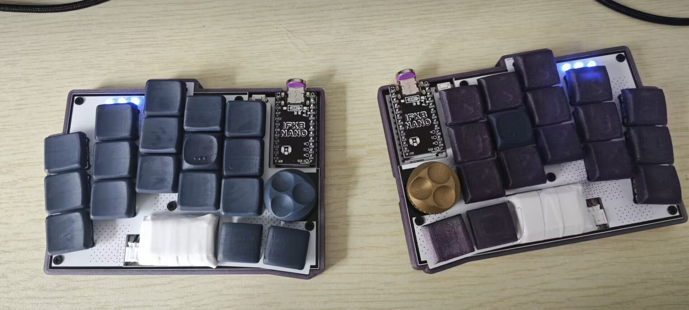
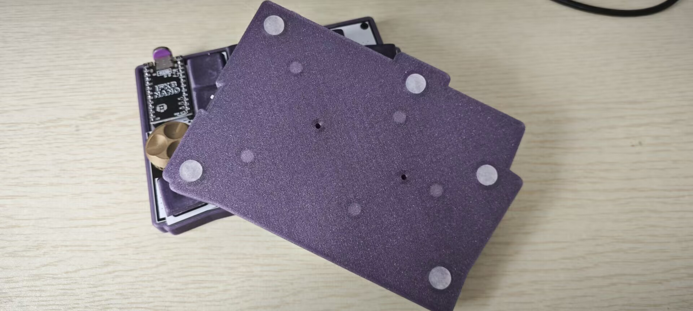
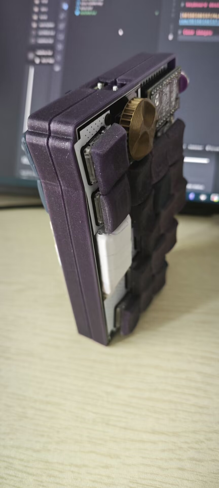

# 3h-print case for klotz

# Keyboard Design

[GEIGEIGEIST/KLOTZ](https://github.com/GEIGEIGEIST/KLOTZ)

# Part List

| part            | count            |
| --------------- | ---------------- |
| 6mm M2 screws   | 10               |
| M2 bolts        | 10               |
| 8mm Rubber foot | 10               |
| 5mm n52 magnet  | 10 (no required) |

# Case images

